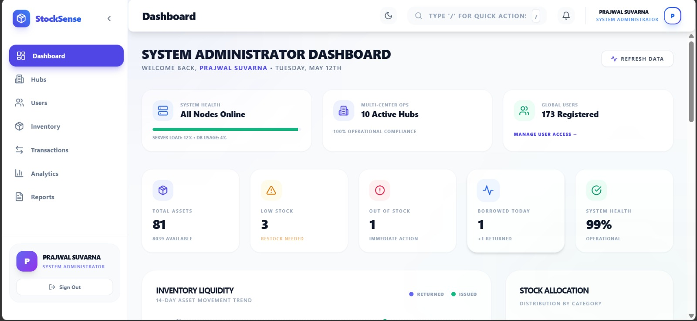
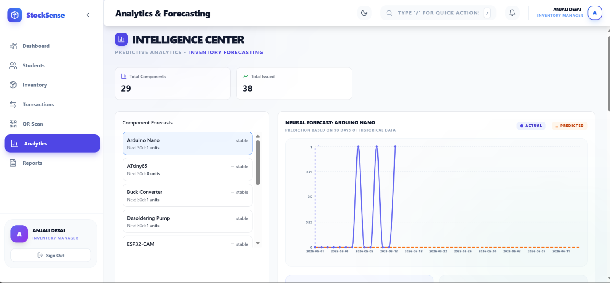
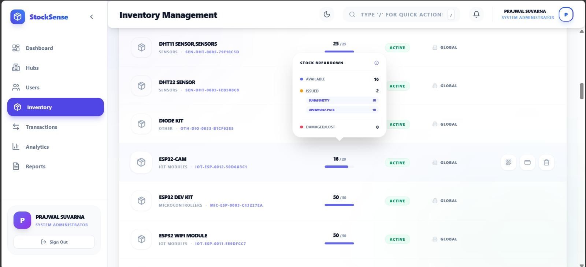
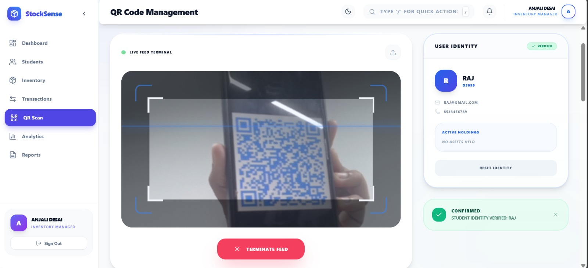

# Inventory Demand Forecaster

An AI-powered inventory management system that predicts future inventory demand using Machine Learning. The project helps reduce stock shortages, avoid overstocking, enable QR-based tracking, provide real-time alerts, manage multi-center inventory, and recommend IoT components for student projects.

---

# Features

- AI-based Demand Forecasting
- QR Code Inventory Tracking
- Real-Time Stock Monitoring
- Intelligent Stock Alerts
- Multi-Center Inventory Management
- IoT Component Recommendation for Students
- Dashboard Analytics and Reports
- Secure Inventory Data Management

---

# Technologies Used

## Frontend
- React.js
- Bootstrap
- HTML
- CSS
- JavaScript

## Backend
- Flask / Python
- REST APIs

## Database
- MySQL

## Machine Learning
- Scikit-learn
- Pandas
- NumPy

---

# Project Structure

```text
inventory-demand-forecaster/
│
├── backend/
├── frontend/
├── ml-model/
├── dataset/
├── images/
├── README.md
├── requirements.txt
├── package.json
├── LICENSE
└── .gitignore
```

---

# Installation

## Clone Repository

```bash
git clone https://github.com/yourusername/inventory-demand-forecaster.git
```

---

# Backend Setup

```bash
cd backend
pip install -r requirements.txt
python app.py
```

---

# Frontend Setup

```bash
cd frontend
npm install
npm run dev
```

---

# Machine Learning Features

- Predicts future inventory demand
- Reduces stock shortages
- Minimizes overstocking
- Analyzes historical inventory data
- Supports smarter inventory decisions

---

# IoT Component Recommendation Module

The system recommends suitable IoT components such as sensors, microcontrollers, communication modules, and development boards based on student project requirements.

---

# Screenshots

## Dashboard



---

## Demand Forecasting



---

## Inventory Management



---

## QR Code Tracking



---

# Future Enhancements

- Blockchain-based inventory security
- IoT-based smart inventory tracking
- Cloud deployment
- AI chatbot support
- Mobile application support

---

# Security

Sensitive files such as:
- `.env`
- API keys
- Database passwords
- Virtual environments

are excluded using `.gitignore`.

---

# License

This project is licensed under the MIT License.

---

# Authors

- Chidhesh
- Shridhanya
- Pavana
- K M Srujana
- Sharath

---

# GitHub Repository

```bash
git clone https://github.com/yourusername/inventory-demand-forecaster.git
```